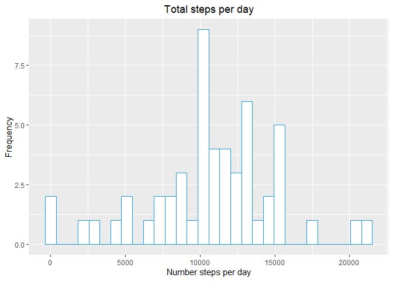
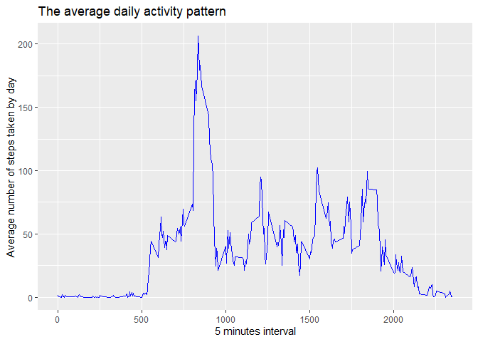
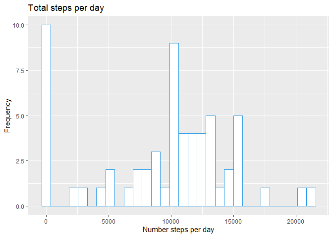
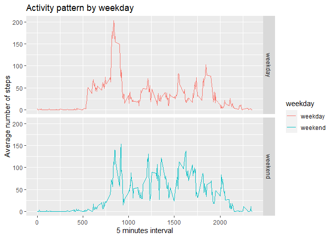

# Reproducible Research: Peer Assessment 1

## Needed library

Before we start we need to load dplyr and ggplot2 so we can plot and
group our data.

    library(dplyr)
    library(ggplot2)

## Setting english time

I needed to make set local time in English because my main language is
Portuguese.

    Sys.setlocale("LC_TIME", "English")

## Loading data processing

1.  After we download and unzip the data we need to load the data.

<!-- -->

    data <- read.csv("activity.csv")

1.  We need to convert the date column from character to date type.

<!-- -->

    data$date <- as.Date(data$date, "%Y-%m-%d")

1.  Remove missing data from the data so we can complete the tasks.

<!-- -->

    clean_data <- na.omit(data)

## What is mean total number of steps taken per day?

1.  Create the data for the histogram

<!-- -->

    total_steps <- clean_data %>% 
                  group_by(date) %>%
                  summarise(sum = sum(steps))

1.  Make the histogram without missing data with ggplot2

<!-- -->

    ggplot(total_steps, aes(sum)) +
        geom_histogram(color=4, fill="White", bins = 30) +
        xlab("Number steps per day") +
        ylab("Frequency") +
        ggtitle("Total steps per day") +
        theme(plot.title = element_text(hjust = 0.5))

1.  Calculate mean of the steps per day

<!-- -->

    mean_steps_day <- mean(total_steps$sum)
    mean_steps_day

    ## [1] 10766.19

1.  Calculate median steps per day

<!-- -->

    median_steps_day <- median(total_steps$sum)
    median_steps_day

    ## [1] 10765

## What is mean total number of steps taken per day?

1.  Preparing data for the plot

<!-- -->

    mean_steps <- clean_data %>% 
        group_by(interval) %>%
        summarise(mean = mean(steps))

1.  Plotting average daily pattern

<!-- -->

    ggplot(mean_steps, aes(interval, mean)) +
                        geom_line(col="blue") +
                        xlab("5 minutes interval") +
                        ylab("Average number of steps taken by day") +
                        ggtitle("The average daily activity pattern")

1.  Maximum 5-minute interval number of mean steps

<!-- -->

    max_five_min <- mean_steps$interval[which.max(mean_steps$mean)]
    max_five_min

    ## [1] 835

## Inputting missing values

Now i´m going to redo the operations but with the missing data with the
value of zero. First i need to know how many missing values exist.

    sum_nas <- sum(is.na(data))
    sum_nas

    ## [1] 2304

1.  Replace missing values with zero.

<!-- -->

    datav2 <- data
    nas_num <- is.na(datav2$steps)
    datav2$steps[nas_num] <- 0

1.  Preparing data for histogram

<!-- -->

    total_stepsv2 <- datav2 %>% 
        group_by(date) %>%
        summarise(sum = sum(steps))

1.  Making the histogram

<!-- -->

    ggplot(total_stepsv2, aes(sum)) +
        geom_histogram(color=4, fill="White", bins=30) +
        xlab("Number steps per day") +
        ylab("Frequency") +
        ggtitle("Total steps per day")

1.  Calculate mean of the steps per day

<!-- -->

    mean_steps_dayv2 <- mean(total_stepsv2$sum)
    mean_steps_dayv2

    ## [1] 9354.23

1.  Calculate median steps per day

<!-- -->

    median_steps_dayv2 <- median(total_stepsv2$sum)
    median_steps_dayv2

    ## [1] 10395

1.  Comparing the first value without missing values and the second
    value with the missing values replaced by zero. Our new mean dropped
    to 9354 steps as well as our median shifted to 10395 steps

<!-- -->

    summary(total_steps)

    ##       date                 sum       
    ##  Min.   :2012-10-02   Min.   :   41  
    ##  1st Qu.:2012-10-16   1st Qu.: 8841  
    ##  Median :2012-10-29   Median :10765  
    ##  Mean   :2012-10-30   Mean   :10766  
    ##  3rd Qu.:2012-11-16   3rd Qu.:13294  
    ##  Max.   :2012-11-29   Max.   :21194

    summary(total_stepsv2)

    ##       date                 sum       
    ##  Min.   :2012-10-01   Min.   :    0  
    ##  1st Qu.:2012-10-16   1st Qu.: 6778  
    ##  Median :2012-10-31   Median :10395  
    ##  Mean   :2012-10-31   Mean   : 9354  
    ##  3rd Qu.:2012-11-15   3rd Qu.:12811  
    ##  Max.   :2012-11-30   Max.   :21194

## Are there differences in activity patterns between weekdays and weekends?

1.  Create new column so we can distinguish weekday from weekend.

<!-- -->

    datav2$weekday <- sapply(datav2$date, function(x){
        if(weekdays(x) == "Saturday" | weekdays(x)=="Sunday"){
            weekday <- "weekend"
        } else {
            weekday <- "weekday"
        }
    })

1.  Calculate average steps by interval and weekday

<!-- -->

    mean_steps_weekday <- datav2 %>% 
        group_by(interval, weekday) %>%
        summarise(mean = mean(steps))

    ## `summarise()` has grouped output by 'interval'. You can override using the
    ## `.groups` argument.

3 Plotting the data

    ggplot(mean_steps_weekday, aes(interval, mean, color = weekday)) +
        geom_line() +
        facet_grid(weekday ~ .) +
        xlab("5 minutes interval") +
        ylab("Average number of steps") +
        ggtitle("Activity pattern by weekday")

